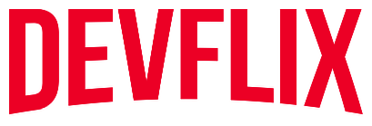

   

	
  

  
  
   
   

> 📺 Seria legal poder registrar e administrar em um lugar todos os videos
> relacionados à dev que eu desejo/quero aprender. Os vídeos poderiam ser catalogados,
> relacionados, buscados e gerenciados de acordo com algum contexto/necessidade em
> um determinado momento. Imagina se a gente tivesse isso para o nosso contexto de
> curso, por exemplo? Vamos montar o nosso DevFlix?.

    <a href="README.md">Português</a>

  O projeto DevFlix. Foi projetado com ❤︎ por
    <a href="https://github.com/tonicprism">Luiz Gustavo</a>
    <a href="https://github.com/MurylloEx">Muryllo Pimenta</a>
    <a href="https://github.com/KelvinVasconcelos">Kelvin Vasconcelos</a>
    <a href="https://github.com/Wolf-gangSE">Lucas Henrique</a>
  

# :computer: Tecnologias

Este projeto foi feito utilizando as seguintes tecnologias:

- [React](#)
- [NextJS](#)

Deixe uma ⭐️ se este projeto ajudou você!
